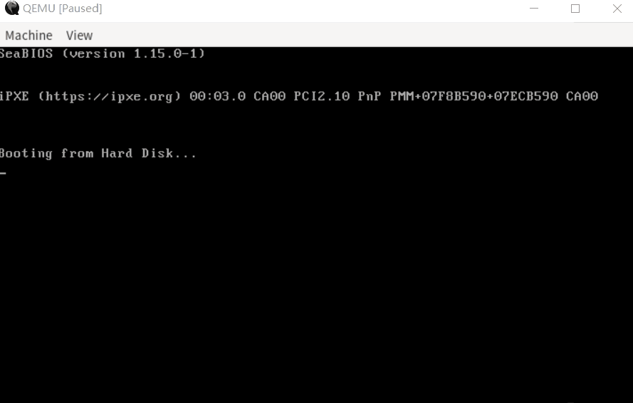

# Tiny OS

## 简介
`Tiny OS` 是一个运行在 `x86_64` 架构上的操作系统。

## 环境配置

### 开发平台
本项目在 `linux` 系统上开发。`windows` 系统上可以通过安装 `WSL` 运行 `linux` 子系统。

如果你使用的是 `WSL`:
- 在 `windows` 中安装一个 X Server；推荐安装 [Xming](https://sourceforge.net/projects/xming/) 或 [VcXsvr](https://sourceforge.net/projects/xming/)。
    - 需要通过 `-ac` 启动 X Server , 或者通过 GUI 勾选 `disable access control` 。
- 在 `WSL` 中:
    - 如果使用的是 `WSL` (version 1):
    ```bash
    export DISPLAY=:0
    ```
    - 如果使用的是 `WSL2` (version 2):
    ```bash
    export DISPLAY=$(cat /etc/resolv.conf | grep nameserver | awk '{print $2}'):0
    ```
    如果不想每开一个终端都输入上述语句, 就把它加在 `~/.bashrc` 或者 `~/.profile` 文件的末尾。
- 如果发生类似 `Could not initialize SDL (No available video device) ...` 或者任何关于 GTK 等错误，请检查你的 X Server 是否启动以及是否正确设置了环境变量 `DISPLAY` 。

### Rust
`Rust` 是一门现代的系统级编程语言，本项目主要使用 `Rust` 语言开发。通过[Rust 官网](https://www.rust-lang.org/tools/install)下载并安装。注意：本项目要求安装 `nightly` 版工具链。

在安装完成后，通过 `rustup` 安装 `llvm-tools`:

```shell
rustup component add llvm-tools-preview
```

通过 `cargo` 安装一些有用的工具，用于开发:

```shell
cargo install cargo-binutils
```

### 安装 `bochs` 模拟器
通过 `bochs` 模拟器进行模拟。源代码下载链接：[Source Forge -- Bochs x86 PC emulator ](https://sourceforge.net/projects/bochs/files/bochs/)。下载完后, 编译安装。

### 编译内核
命令如下:

```shell
cargo run --release
```

编译好的内核镜像路径为 `target/os.img`。

### 准备镜像
通过 `bximage` 在 `./bochs` 目录下创建一个 `os.img` 文件:

```shell
bximage -func=create -hd=10M -imgmode=flat ./bochs/os.img -q
```

通过 `dd` 工具将 `./target/os.img` 刻入 `./bochs/os.img` 中:

```shell
# 注意下面的参数 count 要根据生成的 target/os.img 文件的大小进行调整
dd if=target/os.img of=bochs/os.img bs=512 count=250 conv=notrunc
```

## 运行 `bochs`
在目录下 `bochs/conf` 有如下配置文件:
- `bochsdbg-gdb.bxrc`: 可以通过 `gdb` 远程调试，绑定 `localhost:1234`(需要在编译 `bochs` 时，开启 `--enable-gdb-stub`)
- `bochsdbg-win`: 在 `window` 平台上开启 `bochs` 的、带有图形界面的 `debugger`
- `bochsrc.bxrc`: 最基础的 `bochs` 配置文件，不带有 `debug` 功能

运行 `bochs`，开启模拟:

```shell
bochs -q -f bochs/conf/bochsrc.bxrc
```

## 运行 `qemu`
不同于 `bochs`，`qemu` 可以直接加载生成的 `target/os.img`: 

```shell
qemu-system-x86_64 -drive format=raw,file=bochs/os.img -boot c
```



## Makefile
项目根目录下有一个 `Makefile` 文件，里面定义了一些运行和调试的命令:
- `clean`: 用于清理生成的文件
- `build-release`: 用于编译 `release` 版内核镜像
- `build-debug`: 用于编译 `debug` 版内核镜像 (未完成)
- `run-bochs`: 用于编译内核镜像，并启动 `bochs` 模拟
- `run-qemu`: 用于编译内核镜像，并启动 `qemu` 模拟
- `debug-bochs`: 用于编译内核镜像，启动 `bochs` 并通过 `rust-gdb` 远程 `debug`
- `debug-qemu`: 用于编译内核镜像，启动 `qemu` 并通过 `rust-gdb` 远程 `debug`


## 项目结构
本项目主要分为 `4` 个部分:
- `builder`: 位于 `src` 目录下，主要用于编译、构建内核镜像
- `boot`: 位于 `boot` 目录下，是 `tiny OS` 的 `bootloader`
- `boot_info`: 位于 `boot_info` 目录下，提供 `BootInfo` 结构
- `kernel`: 位于 `kernel` 目录下，是 `tiny OS` 的内核代码

## 开发计划
- bootloader
    - [x] 进入保护模式
    - [x] 开启分页管理
    - [ ] 开启 VGA 的图形显示模式
    - [x] 通过 0xE820 BIOS function 获取 memory_map
    - [x] 进入 `long mode`
    - [x] 准备 `BootInfo` 结构用于从 `bootloader` 阶段传递信息到 `kernel`
    - [x] 加载内核的 `elf` 文件
    - [x] 为内核代码做虚拟地址映射, 并跳转到内核运行
- kernel
    - [x] 准备 `logger` (用于实现 `tiny os` 的 打印函数以及内核开发时 debug )
    - [ ] 处理各种异常、中断
        - [x] 初步处理时钟中断
        - [x] 初步处理键盘输入
        - [x] 初步处理 `Page Fault`
        - [x] 初步处理 `GP Fault`
        - [x] 处理 `Double Fault`
    - [ ] 实现动态内存分配器
        - [x] 通过 [`linked_list_allocator`](https://crates.io/crates/linked_list_allocator) 实现初步的内存分配
        - [ ] 实现 `buddy system` 内存分配器
    - [ ] 实现多任务(抢占式调度)
    - [ ] 实现内核级的协作式调度
    - [ ] 实现 `FAT32` 文件系统
    - [ ] 实现 `shell`
- 编译
    - [ ] 实现更灵活的 `Builder` (可以选择编译 `debug` 版和 `release` 版的镜像)
    - [ ] 生成 `bochs` 可以直接加载的内核镜像，而不是通过 `dd` 工具刻入 `bochs/os.img` 中

## 参考资料
- [AMD64 Architecture Programmer’s Manual Volume 2: System Programming](https://www.amd.com/system/files/TechDocs/24593.pdf)
- [Intel® 64 and IA-32 Architectures Software Developer’s Manual Volume 3 (3A, 3B, 3C & 3D): System Programming Guide](https://cdrdv2.intel.com/v1/dl/getContent/671200)
- 《操作系统真象还原》郑钢
- Coding Master 系列视频: [bilibili -- Coding Master ](https://space.bilibili.com/41036636/channel/collectiondetail?sid=1096)
- OsDev: [OsDev](wiki.osdev.org)
- blog os: [Writing an OS in Rust](https://os.phil-opp.com/)